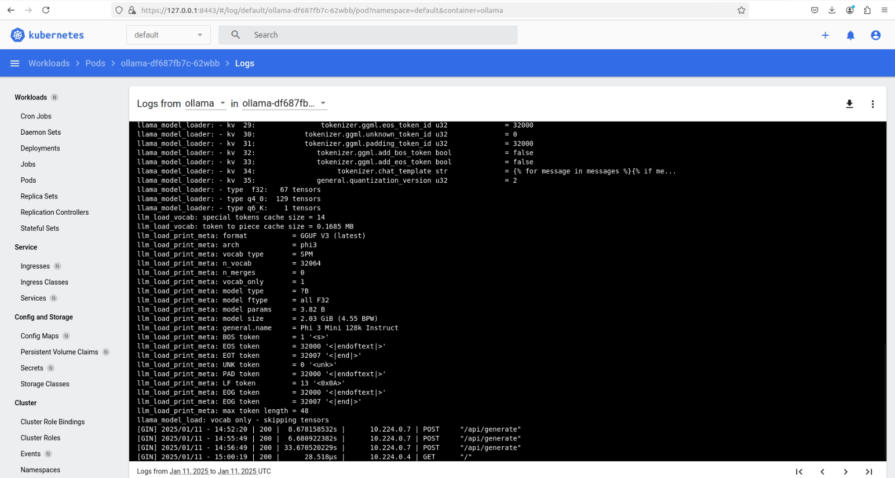

# Deploy di un'applicazione Gen AI basata su Ollama su Kubernetes

In questo tutorial, esploreremo come effettuare il deploy di un'applicazione Gen AI basata su Ollama su Kubernetes. Testeremo inizialmente il deployment in locale utilizzando **Minikube**, quindi lo estenderemo per il deploy su **Azure Kubernetes Service (AKS)** con supporto GPU.

---

## **Parte 1: Deploy su Minikube**

Assumiamo che **Minikube** sia già installato sul tuo sistema.

### **Step 1: Avvio del cluster Minikube**
Prima di tutto, avviamo un cluster Minikube con il comando:

```bash
minikube start 
```

Questo comando crea un cluster Kubernetes in esecuzione all'interno di Docker.

### **Step 2: Creazione del file `deployment.yaml`**
Il file `deployment.yaml` specifica il deployment del container e il servizio che lo espone. Verifica di avere il seguente file nella tua directory di lavoro:

```yaml
apiVersion: apps/v1
kind: Deployment
metadata:
  name: ollama
spec:
  replicas: 1
  selector:
    matchLabels:
      app: ollama
  template:
    metadata:
      labels:
        app: ollama
    spec:
      containers:
      - name: ollama
        image: fabiovisionsystem/ollama-phi:latest 
        ports:
        - containerPort: 11434
        resources:
          requests:
            cpu: "1"
            memory: "2Gi"

---
apiVersion: v1
kind: Service
metadata:
  name: ollama-service
spec:
  type: LoadBalancer
  ports:
  - port: 11434
    targetPort: 11434
    protocol: TCP
  selector:
    app: ollama
```

- **Deployment**:
  - Specifica 1 replica del container `fabiovisionsystem/ollama-phi:latest`.
  - La richiesta di risorse è minima: 1 CPU e 2Gi di memoria.
- **Service**:
  - Espone l'applicazione sulla porta **11434** utilizzando un LoadBalancer.

### **Step 3: Applicazione del file di configurazione**
Applichiamo il deployment e il servizio al cluster Minikube:

```bash
kubectl apply -f deployment.yaml
```

Puoi verificare lo stato delle risorse con:

```bash
kubectl get pods
kubectl get svc
```

### **Step 4: Verifica del servizio**
Poiché stiamo usando Minikube, il servizio di tipo `LoadBalancer` non funzionerà direttamente. Per accedere al servizio, utilizza il comando `minikube service`:

```bash
minikube service ollama-service
```

Questo comando apre un URL nel browser per accedere all'applicazione.

Puoi mandare richieste HTTP all'applicazione con `curl` (vedi tutorial su [Ollama API](../00_ollama-api/README.md)):

```bash
curl http://<ip_address>/api/generate -d '{
   "model": "phi3",
   "prompt":"How can I substitute a wrong article from Amazon?",
   "stream": false
   }'
```


### **Step 5: Pulizia delle risorse**
Quando hai finito di testare l'applicazione, puoi eliminare il deployment e il servizio con:

```bash
kubectl delete -f deployment.yaml
```

## **Parte 2: Deploy su Azure Kubernetes Service (AKS)**

Ora vedremo come effettuare il deploy dell'applicazione Ollama su **Azure Kubernetes Service (AKS)** con GPU.

### **Step 1: Configurazione di `kubectl`**
Assumiamo che il cluster AKS sia già stato creato tramite la dashboard di Azure. Configuriamo `kubectl` per comunicare con il cluster:

```bash
az aks get-credentials --resource-group corso-aks --name ollama-cluster
```

Con questo comando, scarichiamo le credenziali necessarie e configuriamo il contesto Kubernetes per il cluster AKS.

### **Step 2: Abilitazione del supporto GPU**
Per abilitare il supporto GPU all'interno del cluster appena creato, è necessario seguire la [guida ufficiale di Nvidia](https://docs.nvidia.com/datacenter/cloud-native/gpu-operator/latest/microsoft-aks.html).

Installa la repository Nvidia:
```
helm repo add nvidia https://helm.ngc.nvidia.com/nvidia && helm repo update
```

Installa il Nvidia Operator:
```
helm install gpu-operator nvidia/gpu-operator \
    -n gpu-operator --create-namespace \
    --version=v24.9.1 \
    --set driver.enabled=false \
    --set toolkit.enabled=false \
    --set operator.runtimeClass=nvidia-container-runtime
```

L'output sarà simile al seguente:
```
NAME: gpu-operator
LAST DEPLOYED: Fri May  5 15:30:05 2023
NAMESPACE: gpu-operator
STATUS: deployed
REVISION: 1
TEST SUITE: None
```

L'installazione richiede diversi minuti. Usa il seguente comando per verificare il completamento:
```
kubectl get pods -n gpu-operator -l app=nvidia-cuda-validator
```

L'output sarà simile al seguente:
```
NAME                          READY   STATUS      RESTARTS   AGE
nvidia-cuda-validator-bpvkt   0/1     Completed   0          3m56s
```

Questi comandi configurano i nodi con i driver NVIDIA necessari per eseguire i carichi di lavoro GPU.

### **Step 3: Adattamento del file `deployment.yaml`**
Aggiorniamo il file `deployment.yaml` per specificare l'utilizzo delle GPU. Ecco il file aggiornato:

```yaml
apiVersion: apps/v1
kind: Deployment
metadata:
  name: ollama
  namespace: ollama
spec:
  replicas: 1
  selector:
    matchLabels:
      app: ollama
  template:
    metadata:
      labels:
        app: ollama
    spec:
      containers:
      - name: ollama
        image: fabiovisionsystem/ollama-phi:latest
        ports:
        - containerPort: 11434
        resources:
          limits:
            nvidia.com/gpu: "1" # Richiesta di una GPU
            
---
apiVersion: v1
kind: Service
metadata:
  name: ollama-service
  namespace: ollama
spec:
  type: LoadBalancer
  ports:
  - port: 11434
    targetPort: 11434
    protocol: TCP
  selector:
    app: ollama
```

- La chiave `nvidia.com/gpu: "1"` specifica che il container richiede una GPU.

### **Step 4: Deploy su AKS**
Applichiamo il file aggiornato al cluster AKS:

```bash
kubectl apply -f deployment.yaml
```

Verifica che il pod venga avviato correttamente:

```bash
kubectl get pods
```

### **Step 5: Verifica del servizio**
Poiché stiamo utilizzando un cluster AKS con nodi GPU, il servizio di tipo `LoadBalancer` fornirà un IP pubblico. Verifica il servizio con:

```bash
kubectl get svc ollama-service
```

Nota l'IP esterno (`EXTERNAL-IP`) del servizio e usalo per accedere all'applicazione.

---

## Visualizzazione dello stato del cluster Kubernetes tramite la Dashboard Kubernetes

In questa parte vediamo i passaggi per installare e utilizzare la **Kubernetes Dashboard** per monitorare lo stato del cluster.

### **Parte 1: Installazione della Kubernetes Dashboard**

#### **Step 1: Creazione dello spazio dei nomi**
Creiamo uno spazio dei nomi dedicato per la dashboard Kubernetes:

```bash
kubectl create ns aks-dashboard
```

Questo crea un namespace chiamato `aks-dashboard` per isolare le risorse relative alla dashboard.

#### **Step 2: Installazione della dashboard con Helm**
Utilizziamo Helm per installare la Kubernetes Dashboard nel namespace creato. Assumiamo che la chart Helm della dashboard sia presente nella directory `./kubernetes-dashboard`.

Esegui il comando:

```bash
helm install my-aks-dashboard ./kubernetes-dashboard -n aks-dashboard
```

- Questo comando installa la dashboard con il nome `my-aks-dashboard`.
- La dashboard sarà accessibile all'interno del namespace `aks-dashboard`.

#### **Step 3: Recupero del nome del pod della dashboard**
Dopo l'installazione, individuiamo il pod della dashboard con il seguente comando:

```bash
POD_NAME=$(kubectl get pods -n aks-dashboard -l "app.kubernetes.io/name=kubernetes-dashboard,app.kubernetes.io/instance=my-aks-dashboard" -o jsonpath="{.items[0].metadata.name}")
```

Questo comando salva il nome del pod della dashboard nella variabile `$POD_NAME`.

#### **Step 4: Accesso alla dashboard tramite port forwarding**
Per accedere alla dashboard dal browser locale, esegui il port forwarding al pod della dashboard:

```bash
kubectl -n aks-dashboard port-forward $POD_NAME 8443:8443
```

Ora puoi accedere alla dashboard aprendo il seguente URL nel tuo browser:

```
https://localhost:8443
```

Accere alla dashboard richiede l'autenticazione tramite token. Per ottenere il token, esegui il seguente comando:

```bash
kubectl -n aks-dashboard describe secret $(kubectl -n aks-dashboard get secret | grep my-aks-dashboard | awk '{print $1}')
```

Copia il token e incollalo nella dashboard per accedere.

In alternativa, puoi utilizzare usare la modalità `kubeconfig` per accedere alla dashboard. Selezionare il metodo di autenticazione `kubeconfig` e carica il file di configurazione `~/.kube/config`.


Una volta autenticato, sarai in grado di visualizzare lo stato del cluster tramite la dashboard.


---

### **Parte 2: Visualizzazione dello stato del cluster**

Dopo aver configurato e aperto la dashboard, sarai in grado di:

1. **Visualizzare lo stato dei nodi e dei pod**:
   - Puoi vedere informazioni dettagliate sui nodi, come la disponibilità di CPU, memoria e GPU (se applicabile).
     
   - Verifica lo stato dei pod e i log degli stessi per eventuali problemi.
     
     

2. **Gestire risorse Kubernetes**:
   - Puoi esaminare i dettagli delle risorse come Deployment, ReplicaSet, Service, e altro.
      

3. **Monitorare i carichi di lavoro**:
   - Analizza grafici e tendenze relativi al carico delle risorse.
     

---


## **Conclusioni**
Abbiamo esplorato come effettuare il deploy di un'applicazione Gen AI basata su Ollama sia su **Minikube** che su **Azure Kubernetes Service (AKS)**. Minikube offre un ambiente di test locale, mentre AKS consente il deploy su scala con supporto GPU per applicazioni più esigenti in termini di calcolo. 